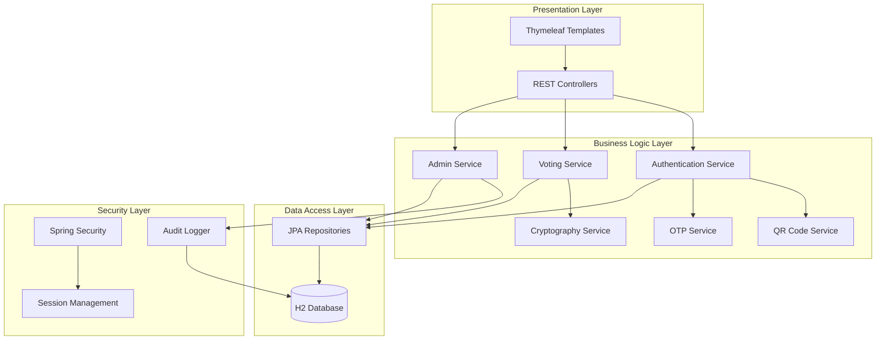

# Design Document

## Overview

The SecureQrVotingSystem is architected as a Spring Boot web application following a layered architecture pattern with clear separation of concerns. The system implements a multi-factor authentication flow using QR codes and OTPs, ensures vote integrity through AES encryption and cryptographic hashing, and provides comprehensive administrative capabilities through a secure dashboard interface.

The design emphasizes security-first principles, modular components for testability, and follows Spring Boot best practices for enterprise-grade applications.

## Architecture

### High-Level Architecture



### Technology Stack

- **Framework**: Spring Boot 3.x with Spring MVC
- **Security**: Spring Security with custom authentication providers
- **Database**: H2 (development), JPA/Hibernate for ORM
- **Frontend**: Thymeleaf template engine with Bootstrap CSS
- **Build Tool**: Maven with Java 17+
- **Libraries**: 
  - ZXing for QR code generation
  - Java Cryptography Architecture (JCA) for encryption
  - Custom OTP implementation using TOTP algorithm
  - SLF4J with Logback for logging

## Components and Interfaces

### 1. Authentication Components

#### QRCodeService
```java
public interface QRCodeService {
    String generateQRCodeData(String userId);
    byte[] generateQRCodeImage(String data);
    boolean validateQRCodeData(String data, String userId);
}
```

#### OTPService  
```java
public interface OTPService {
    String generateOTP(String userId);
    boolean validateOTP(String userId, String otp);
    void invalidateOTP(String userId);
}
```

#### AuthenticationService
```java
public interface AuthenticationService {
    AuthenticationResult authenticateWithQR(String userId, String qrData);
    AuthenticationResult authenticateWithOTP(String userId, String otp);
    void createUserSession(String userId);
    void invalidateSession(String sessionId);
}
```

### 2. Voting Components

#### CryptographyService
```java
public interface CryptographyService {
    EncryptedVote encryptVote(String voteData, String electionId);
    String decryptVote(EncryptedVote encryptedVote);
    String generateHash(String data);
    boolean verifyHash(String data, String hash);
}
```

#### VotingService
```java
public interface VotingService {
    VoteResult castVote(String userId, String candidateId, String electionId);
    boolean hasUserVoted(String userId, String electionId);
    List<Election> getActiveElections();
    Election getElectionDetails(String electionId);
}
```

### 3. Administrative Components

#### AdminService
```java
public interface AdminService {
    Election createElection(ElectionRequest request);
    ElectionResults tallyVotes(String electionId);
    List<AuditLog> getAuditLogs(AuditFilter filter);
    SystemStats getSystemStatistics();
}
```

#### AuditService
```java
public interface AuditService {
    void logUserAction(String userId, String action, String details);
    void logSecurityEvent(String eventType, String details, String ipAddress);
    void logVotingEvent(String userId, String electionId, String eventType);
    void logAdminAction(String adminId, String action, String target);
}
```

## Data Models

### Core Entities

#### User Entity
```java
@Entity
public class User {
    @Id
    private String userId;
    private String username;
    private String email;
    private String passwordHash;
    private String qrCodeSecret;
    private LocalDateTime createdAt;
    private boolean enabled;
    private UserRole role;
}
```

#### Election Entity
```java
@Entity
public class Election {
    @Id
    private String electionId;
    private String title;
    private String description;
    private LocalDateTime startTime;
    private LocalDateTime endTime;
    private ElectionStatus status;
    
    @OneToMany(mappedBy = "election")
    private List<Candidate> candidates;
    
    @OneToMany(mappedBy = "election")
    private List<Vote> votes;
}
```

#### Vote Entity
```java
@Entity
public class Vote {
    @Id
    private String voteId;
    private String userId;
    private String electionId;
    private String encryptedVoteData;
    private String voteHash;
    private LocalDateTime timestamp;
    private String ipAddress;
}
```

#### Candidate Entity
```java
@Entity
public class Candidate {
    @Id
    private String candidateId;
    private String name;
    private String description;
    private String electionId;
    
    @ManyToOne
    @JoinColumn(name = "electionId", insertable = false, updatable = false)
    private Election election;
}
```

#### AuditLog Entity
```java
@Entity
public class AuditLog {
    @Id
    private String logId;
    private String userId;
    private String action;
    private String details;
    private String ipAddress;
    private LocalDateTime timestamp;
    private AuditEventType eventType;
}
```

### Security Models

#### EncryptedVote
```java
public class EncryptedVote {
    private String encryptedData;
    private String initializationVector;
    private String hash;
    private String algorithm;
}
```

#### AuthenticationResult
```java
public class AuthenticationResult {
    private boolean successful;
    private String sessionId;
    private String errorMessage;
    private LocalDateTime expiryTime;
}
```

## Error Handling

### Exception Hierarchy

```java
public class VotingSystemException extends RuntimeException {
    // Base exception for all system errors
}

public class AuthenticationException extends VotingSystemException {
    // Authentication and authorization failures
}

public class VotingException extends VotingSystemException {
    // Vote casting and validation errors
}

public class CryptographyException extends VotingSystemException {
    // Encryption/decryption failures
}

public class ElectionException extends VotingSystemException {
    // Election management errors
}
```

### Error Handling Strategy

1. **Controller Level**: Global exception handler using `@ControllerAdvice`
2. **Service Level**: Business logic validation with custom exceptions
3. **Repository Level**: Data access exceptions wrapped in service exceptions
4. **Security Level**: Authentication failures logged and handled gracefully
5. **Audit Trail**: All errors logged with context for debugging and security monitoring

### Error Response Format

```java
public class ErrorResponse {
    private String errorCode;
    private String message;
    private LocalDateTime timestamp;
    private String path;
    private Map<String, String> validationErrors;
}
```

## Testing Strategy

### Unit Testing
- **Coverage Target**: Minimum 80% code coverage
- **Framework**: JUnit 5 with Mockito for mocking
- **Focus Areas**: 
  - Service layer business logic
  - Cryptography operations
  - Authentication flows
  - Data validation

### Integration Testing
- **Database Integration**: Test repository layer with @DataJpaTest
- **Web Layer**: Test controllers with @WebMvcTest
- **Security Integration**: Test authentication flows end-to-end
- **Cryptography Integration**: Verify encryption/decryption cycles

### Security Testing
- **Authentication Testing**: Verify QR code and OTP validation
- **Authorization Testing**: Ensure proper access controls
- **Encryption Testing**: Validate vote encryption and integrity
- **Session Testing**: Verify session management and timeouts
- **Input Validation**: Test against injection attacks and malformed data

### Test Data Management
- **Test Fixtures**: Predefined test data for consistent testing
- **Database Seeding**: Automated test data setup for integration tests
- **Mock Services**: External service simulation for isolated testing

### Performance Testing
- **Load Testing**: Simulate concurrent voting scenarios
- **Encryption Performance**: Measure cryptographic operation performance
- **Database Performance**: Test query performance under load

## Security Implementation Details

### Encryption Strategy
- **Algorithm**: AES-256-GCM for vote encryption
- **Key Management**: Per-election encryption keys stored securely
- **Initialization Vectors**: Unique IV for each encrypted vote
- **Hash Algorithm**: SHA-256 for vote integrity verification

### Session Management
- **Session Storage**: Server-side session storage with Redis-like caching
- **Session Timeout**: Configurable timeout with automatic cleanup
- **Session Security**: Secure session cookies with HttpOnly and Secure flags
- **CSRF Protection**: Spring Security CSRF tokens for state-changing operations

### Input Validation
- **Bean Validation**: JSR-303 annotations for model validation
- **Custom Validators**: Business rule validation for voting constraints
- **SQL Injection Prevention**: Parameterized queries through JPA
- **XSS Prevention**: Output encoding in Thymeleaf templates

### Audit and Monitoring
- **Comprehensive Logging**: All user actions and system events logged
- **Security Event Detection**: Automated detection of suspicious activities
- **Log Integrity**: Tamper-evident logging with cryptographic signatures
- **Performance Monitoring**: Application metrics and health checks